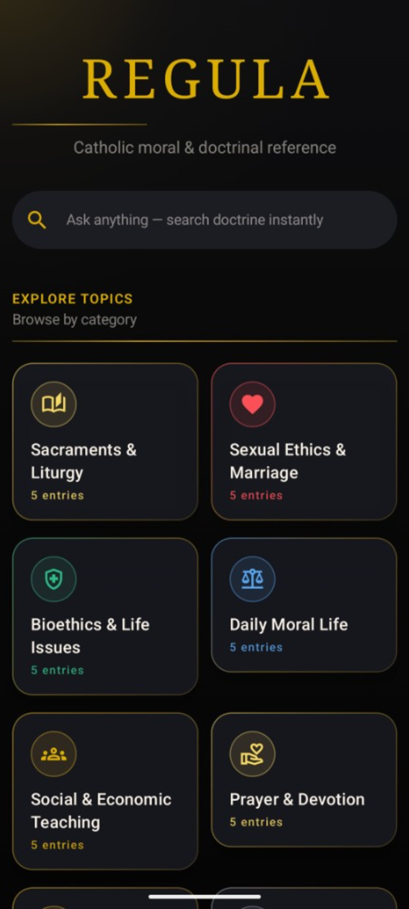
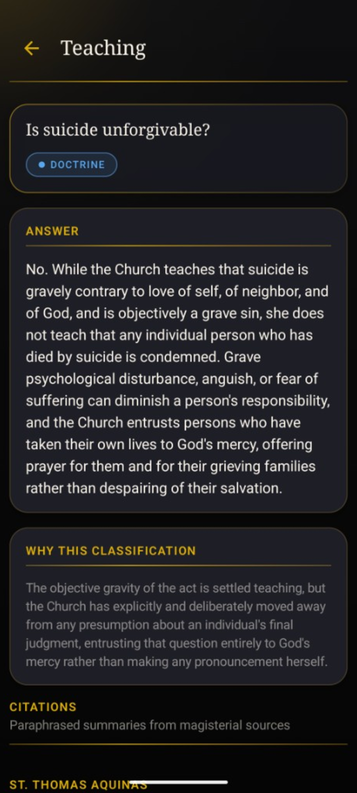
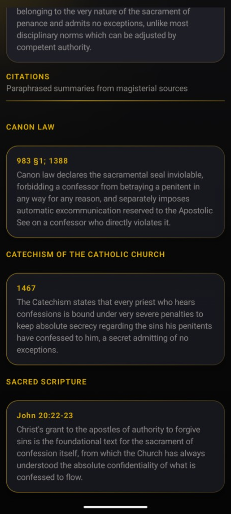

<p align="center">
  
</p>

<h1 align="center">Regula</h1>

<p align="center">
  <strong>Offline Catholic moral &amp; doctrinal reference for Android</strong>
</p>

<p align="center">
  <a href="LICENSE"></a>
  
  
  
  
  
</p>

<p align="center">
  Browse teaching by topic · Classify dogma, doctrine, discipline &amp; opinion · Search instantly · Cite the magisterium — all on-device, with no tracking.
</p>

---

## Contents

- [Overview](#overview)
- [Features](#features)
- [Screenshots](#screenshots)
- [Privacy](#privacy)
- [Content](#content)
- [Build &amp; install](#build--install)
- [F-Droid](#f-droid)
- [Tech stack](#tech-stack)
- [Project structure](#project-structure)
- [License](#license)

---

## Overview

**Regula** helps Catholics find clear, concise answers to moral and doctrinal questions — organized by category, classified by binding force, and backed by paraphrased citations from magisterial sources.

Everything lives on your device. The app has **no network permission**, no analytics, and no proprietary SDKs. It is built for clarity of teaching and for distribution on **[F-Droid](https://f-droid.org/)**.

| | |
|---|---|
| **Version** | 1.0.0 (`versionCode` 2) |
| **Categories** | 8 |
| **Entries** | 40 Q&amp;A articles |
| **Citations** | 119 source references |
| **Package** | `org.regula.app` |

---

## Features

### Browse by topic

Eight curated categories cover the questions Catholics ask most often:

| Category | Topics include |
|----------|----------------|
| Sacraments &amp; Liturgy | Non-Catholic weddings, confession seal, communion, baptism, holy days |
| Sexual Ethics &amp; Marriage | NFP, cohabitation, annulment, IVF |
| Bioethics &amp; Life Issues | Abortion, euthanasia, organ donation, vaccines |
| Daily Moral Life | Lying, gambling, modesty, tattoos |
| Social &amp; Economic Teaching | Just war, immigration, voting, usury |
| Prayer &amp; Devotion | Indulgences, saints, private revelation, relics |
| Ecclesiology &amp; Authority | Papal authority, schism, apostolic succession |
| Death &amp; Afterlife | Cremation, purgatory, suicide, praying for the dead |

### Classified teaching

Every entry carries a **classification badge** — dogma, doctrine, discipline, or theological opinion — with a short note explaining *why* it is classified that way.

### Magisterial citations

Each answer links to up to three citations, grouped by source type:

`CCC` · `Canon Law` · `Magisterial` · `Aquinas` · `Scripture`

Summaries are paraphrased for readability; references point you to the original text.

### Instant search

Search across every question and answer from the welcome screen. No server, no delay — Room queries run locally in milliseconds.

### Designed for clarity

Dark gold Material 3 UI, glass cards, and readable typography — built for reference, not distraction.

---

## Screenshots

<p align="center">
  
  &nbsp;&nbsp;
  
  &nbsp;&nbsp;
  
</p>

<p align="center"><sub>Welcome &amp; search · Entry detail · Citations</sub></p>

Store listing assets for F-Droid live in [`fastlane/metadata/android/en-US/`](fastlane/metadata/android/en-US/).

---

## Privacy

Regula is **offline-first by architecture**, not by policy alone:

| | |
|---|---|
| Network permission | **None** |
| Analytics / crash reporters | **None** |
| Firebase / Play Services | **None** |
| In-app purchases / ads | **None** |
| Data collection | **None** — all content is bundled in the APK |

The release manifest contains no `INTERNET` permission. Your searches and browsing never leave the device.

---

## Content

All doctrinal content is authored in JSON — there is no in-app editor.

| Resource | Path |
|----------|------|
| **Shipped content** | [`app/src/main/assets/content/content.json`](app/src/main/assets/content/content.json) |
| **Authoring guide** | [`content/README.md`](content/README.md) |
| **JSON schema** | [`content/schema.json`](content/schema.json) |

**Workflow:**

1. Edit `content.json` (`categories` = topics, `entries` = articles, nested `citations`).
2. Bump `"contentVersion"` so installed apps reload the Room database on next launch.
3. Rebuild — no uninstall required.

**Allowed enum values:**

- `classification`: `dogma` · `doctrine` · `discipline` · `theological_opinion`
- `sourceType`: `ccc` · `canon_law` · `aquinas` · `magisterial` · `scripture`

New categories use a default icon until you add a mapping in [`CategoryVisuals.kt`](app/src/main/kotlin/org/regula/app/ui/components/CategoryVisuals.kt).

---

## Build & install

### Prerequisites

- **JDK 17** — required (JDK 25+ is not yet supported by the Android Gradle Plugin)
- **Android SDK** with API 36 platform
- `ANDROID_HOME` or `ANDROID_SDK_ROOT` pointing to your SDK  
  (see [`local.properties.example`](local.properties.example))

### Debug (local testing)

```bash
export JAVA_HOME=/usr/lib/jvm/temurin-17-jdk   # adjust path if needed

./gradlew assembleDebug
./gradlew installDebug          # USB device or emulator
```

APK: `app/build/outputs/apk/debug/app-debug.apk` — sideload to your phone for testing.

### Release (F-Droid / production)

```bash
./gradlew :app:assembleRelease
```

APK: `app/build/outputs/apk/release/app-release-unsigned.apk`

F-Droid builds from source and signs with their own key; you do **not** commit a release keystore.

---

## F-Droid

Regula is built for [F-Droid](https://f-droid.org/) distribution: FOSS-only dependencies, no network permission, GPLv3, and store metadata in the repo.

```
fastlane/metadata/android/en-US/
├── title.txt
├── short_description.txt
├── full_description.txt
├── changelogs/<versionCode>.txt
└── images/
    ├── icon.png
    └── phoneScreenshots/1.png … 3.png
```

F-Droid builds from a tagged release (`./gradlew :app:assembleRelease`) and signs the APK with their key.

---

## Tech stack

| Layer | Choice |
|-------|--------|
| Language | Kotlin 2.1 |
| UI | Jetpack Compose, Material 3 |
| Persistence | Room (SQLite) |
| Navigation | Navigation Compose |
| Content | JSON assets → version-aware re-seed on startup |
| Build | Gradle Kotlin DSL, single `:app` module |
| SDK | minSdk 26 · compileSdk / targetSdk 36 |

Dependencies are **AndroidX only** — no proprietary libraries.

---

## Project structure

```
Regula/
├── app/src/main/
│   ├── assets/content/content.json   # doctrinal database (source of truth)
│   ├── kotlin/org/regula/app/        # application code
│   └── res/                          # theme, launcher icons
├── content/                          # authoring docs + JSON schema
├── fastlane/metadata/android/en-US/  # F-Droid store listing
├── ICONS/                            # source icon assets
└── LICENSE                           # GPLv3
```

---

## License

Copyright © 2026 Regula contributors

Regula is free software: you can redistribute it and/or modify it under the terms of the **GNU General Public License v3.0 or later**.

See [`LICENSE`](LICENSE) for the full text.

---

<p align="center">
  <sub>Built for clarity of teaching · Fully offline · Free as in freedom</sub>
</p>
